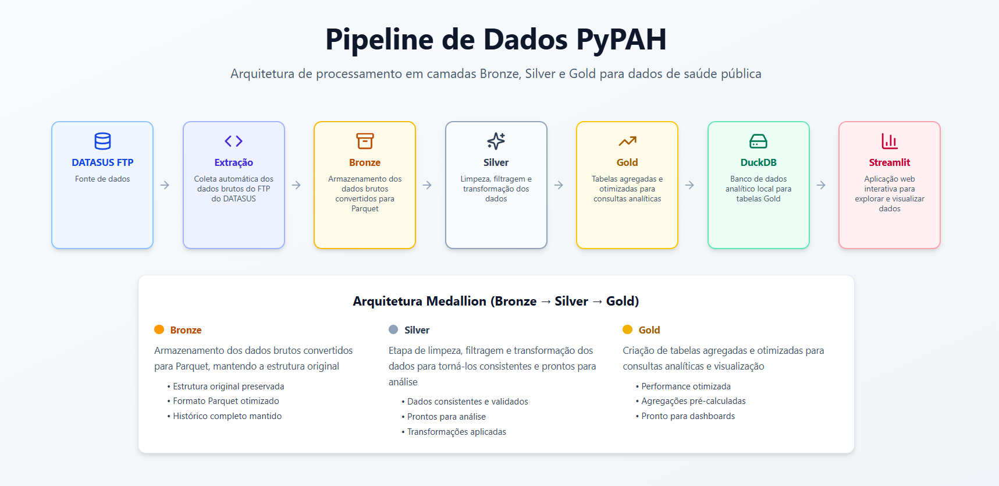
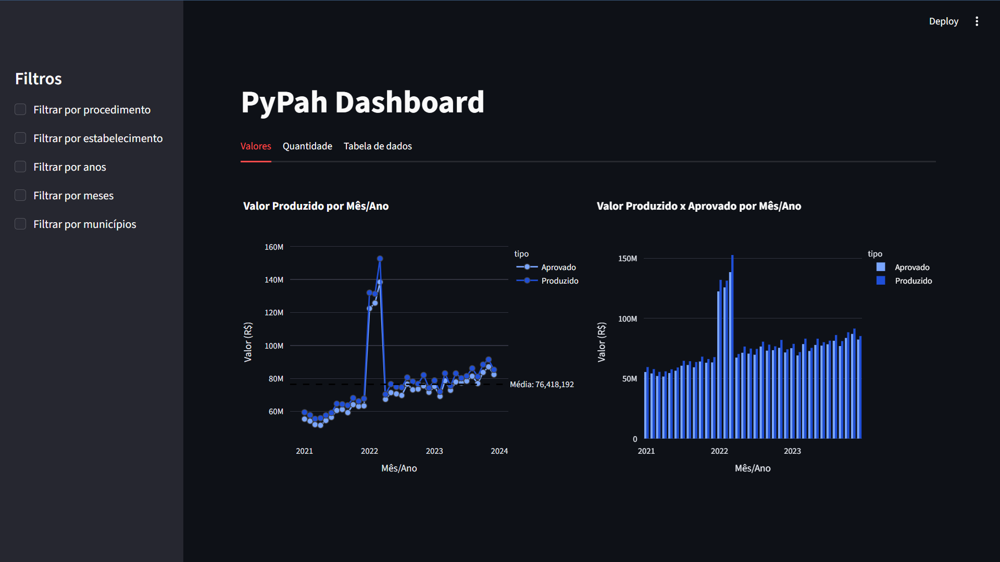
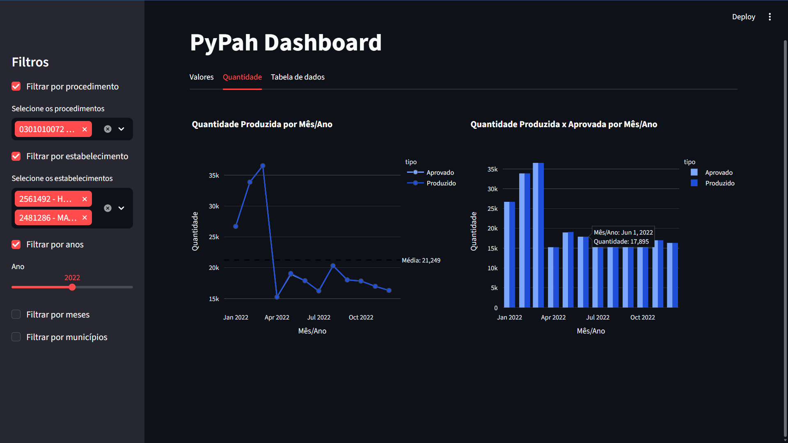

# PyPAH

<p align="center">


</p>

---

Este repositório demonstra como criar um **dashboard utilizando Streamlit na linguagem de programação Python**.

A importância de dashboards está na capacidade de **tornar dados complexos mais claros e acessíveis**, permitindo que:

- cidadãos compreendam melhor informações públicas
- analistas explorem dados com mais facilidade
- gestores tomem decisões mais informadas

No contexto deste projeto, **PyPAH**, utilizamos dados de saúde provenientes do **DATASUS**, banco de dados do **SUS (Sistema Único de Saúde)** do Governo do Brasil.

Mais especificamente, utilizamos dados do **Sistema de Informações Ambulatoriais (SIA)**, focando na **Produção Ambulatorial (PA)**.

O projeto demonstra uma forma de lidar com dados públicos utilizando Python, realizando todo o processo de:

- **Extração** de dados do FTP do DATASUS
- **Transformação** com limpeza e filtros
- **Carga** em um banco de dados analítico

O resultado final é servido em um **dashboard interativo utilizando Streamlit**.

---

# Arquitetura do Pipeline



O pipeline de dados segue o modelo de arquitetura em camadas utilizado em engenharia de dados:

```text
DATASUS FTP
     ↓
Extração (Python / PySUS)
     ↓
Bronze (Parquet)
     ↓
Silver (dados tratados)
     ↓
Gold (tabelas agregadas)
     ↓
DuckDB
     ↓
Streamlit Dashboard
```

### Descrição das camadas

**Extração**  
Coleta automática dos dados brutos do FTP do DATASUS utilizando Python.

**Bronze**  
Armazenamento dos dados brutos convertidos para Parquet, mantendo a estrutura original.

**Silver**  
Etapa de limpeza, filtragem e transformação dos dados para torná-los consistentes.

**Gold**  
Criação de tabelas agregadas otimizadas para consultas analíticas e visualização.

**DuckDB**  
Banco analítico local que armazena as tabelas Gold.

**Streamlit**  
Aplicação web interativa para exploração e visualização dos dados.

---

# Tecnologias Utilizadas

| Tecnologia | Uso |
|----------|---------------------------|
| Python | Pipeline ETL |
| DuckDB | Banco analítico |
| Streamlit | Dashboard |
| Docker | Containerização |
| Parquet | Armazenamento colunar |
| PySUS | Acesso aos dados do DATASUS |
| WSL | Ambiente Linux no Windows |

---

# Dataset

Os dados utilizados neste projeto são provenientes do **DATASUS**, base pública do Sistema Único de Saúde (SUS) mantida pelo Ministério da Saúde.

Fonte oficial:

https://datasus.saude.gov.br/

Especificamente utilizamos dados do:

- Sistema de Informações Ambulatoriais (SIA)
- Produção Ambulatorial (PA)

Os dados são disponibilizados em formato `.dbc` no FTP público do DATASUS e são convertidos para **Parquet** durante o processo de ETL.

---

# Organização das Pastas do Projeto

```text
PyPAH
│
├── dados_sia/
│   ├── dados_dbc/
│   ├── Bronze/
│   ├── Silver/
│   ├── Gold/
│   └── rotulos/
│
├── docs/
│   ├── arquitetura_PyPAH.png
│   ├── app_com_filtro.png
│   └── app_sem_filtro.png
|
├── db/
│   └── db.duckdb
│
├── Docker/
│   ├── Dockerfile.dev
│   ├── Dockerfile.user
│   └── entrypoint_user.sh
│
├── ETL/
│   ├── fun_sia.py
│   ├── gold.py
│
├── requirements/
│   ├── requirements_dev.txt
│   └── requirements_user.txt
│
├── Streamlit/
│   └── dash_PyPAH.py
│
├── .dockerignore
├── docker-compose.yml
├── LICENSE
└── .gitignore
```

---

# Estrutura de Dados

A pasta **dados_sia** armazena os dados utilizados dentro do projeto.

Ela contém cinco subpastas:

**dados_dbc**  
Dados brutos compactados em `.dbc` baixados do FTP do DATASUS.

**Bronze**  
Dados descompactados e convertidos para **Parquet**.

Cada pasta representa **um mês de dados**.

**Silver**  
Dados após filtragem, limpeza e criação de novas colunas.

**Gold**  
Dados agregados e prontos para análise e visualização.

**rotulos**  
Tabelas dimensão utilizadas para rotular colunas e filtros do dashboard.

---

# Banco de Dados

A pasta **db** contém o arquivo:

```
db.duckdb
```

Ele utiliza **DuckDB**, um banco de dados analítico otimizado para processamento local e ideal para dashboards.

As tabelas da camada **Gold** são armazenadas nele.

---

# Docker

A pasta **Docker** contém os arquivos responsáveis pela containerização.

### Dockerfile.dev

Cria um container com todas as dependências do projeto para desenvolvimento completo.

### Dockerfile.user

Cria um container mais leve contendo apenas as dependências necessárias para executar o dashboard.

### entrypoint_user.sh

Script executado automaticamente ao iniciar o container user.

Ele:

1. verifica se o arquivo `db.duckdb` existe localmente
2. caso não exista, baixa automaticamente um release com **3 anos de dados**
3. inicia o dashboard Streamlit

---

# Dashboard

### Visualização geral



### Aplicação de filtros



A aplicação permite explorar os dados através de filtros interativos e visualizar indicadores de produção ambulatorial.

---

# Execução do Projeto

## Clonar o repositório

```bash
git clone https://github.com/repositorio-paineis-publicos/PyPAH
```

---

## Acessar a pasta do projeto

```bash
cd caminho_do_projeto
```

---

## Caso esteja utilizando Windows, ativar o WSL

```bash
wsl
```

---

## Construir o container Docker

Para desenvolvimento completo:

```bash
docker compose up --build -d pypah-dev
```

Para apenas executar o dashboard:

```bash
docker compose up --build -d pypah-APP
```

---

## Conectar ao container no VS Code

Pressione:

```
Ctrl + Shift + P
```

Digite:

```
Dev Containers: Attach to Running Container
```

Selecione o container desejado.

---

## Executar o dashboard

```bash
streamlit run Streamlit/dash_PyPAH.py
```

O navegador abrirá automaticamente.

Caso não abra, acesse:

```
localhost:PORTA
```

Portas padrão:

| Container | Porta |
|--------|------|
| app | 8501 |
| dev | 8502 |

Caso deseje alterar, edite o arquivo:

```
docker-compose.yml
```

---

# Observação

Inicialmente, as pastas:

- `dados_sia/`
- `db/`

não estão presentes no repositório.

Elas são criadas automaticamente durante a execução do pipeline.

---
