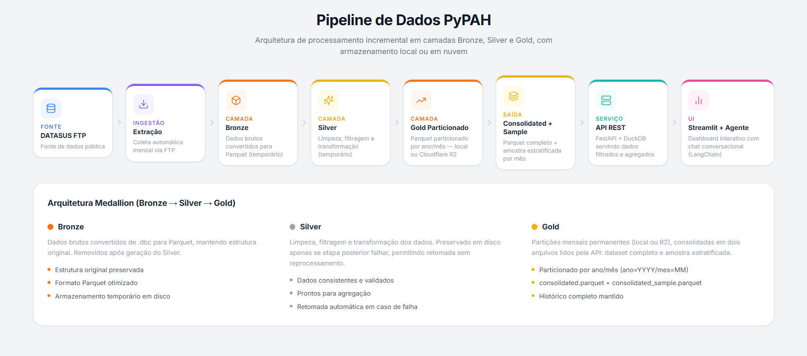
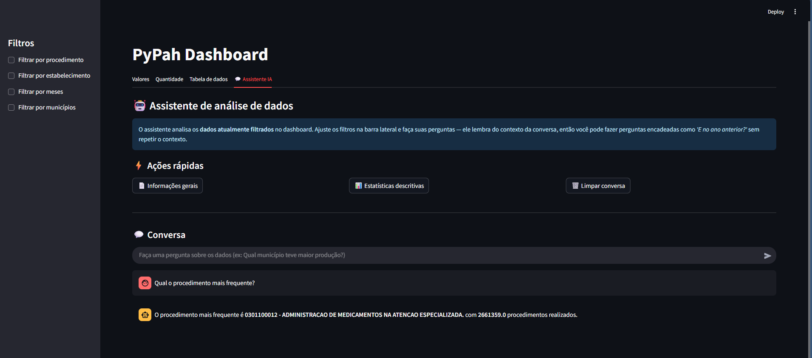

# PyPAH

<p align="center">


</p>

---

Este repositório demonstra como criar um **dashboard utilizando Streamlit na linguagem de programação Python**, com um **agente conversacional** integrado para exploração dos dados por linguagem natural.

A importância de dashboards está na capacidade de **tornar dados complexos mais claros e acessíveis**, permitindo que:

- cidadãos compreendam melhor informações públicas
- analistas explorem dados com mais facilidade
- gestores tomem decisões mais informadas

No contexto deste projeto, **PyPAH**, utilizamos dados de saúde provenientes do **DATASUS**, banco de dados do **SUS (Sistema Único de Saúde)** do Governo do Brasil.

Mais especificamente, utilizamos dados do **Sistema de Informações Ambulatoriais (SIA)**, focando na **Produção Ambulatorial (PA)** do estado do **Ceará**.

O projeto demonstra uma forma de lidar com dados públicos utilizando Python, realizando todo o processo de:

- **Extração** automática e periódica dos dados do FTP do DATASUS
- **Transformação** com limpeza, filtros e agregações
- **Carga** incremental em armazenamento local ou em nuvem
- **Serviço** dos dados via API REST
- **Visualização** em um dashboard interativo
- **Exploração conversacional** dos dados via agente com LLM

---

# Arquitetura do Pipeline



O pipeline de dados segue o modelo de arquitetura em camadas utilizado em engenharia de dados, com atualização automática mensal:

```text
DATASUS FTP  (dados mensais em .dbc)
     ↓
Extração (Python / PySUS)
     ↓
Bronze (Parquet temporário)
     ↓
Silver (dados tratados — temporário)
     ↓
Gold particionado (Parquet por mês)
     ↓
Consolidated + Sample estratificado (Parquet)
     ↓
API REST (FastAPI + DuckDB)
     ↓
Streamlit Dashboard + Agente Conversacional
```

O destino de gravação de cada camada permanente (Gold, Consolidated, dimensões) é decidido por um único módulo, `storage.py`, que abstrai **armazenamento local** ou **Cloudflare R2** por trás da mesma interface — nenhuma outra parte do código precisa saber qual dos dois está em uso (ver seção [Armazenamento](#armazenamento-local-ou-cloudflare-r2)).

### Descrição das camadas

**Extração**
Coleta automática dos dados brutos do FTP público do DATASUS. O pipeline detecta automaticamente quais meses ainda não foram processados e baixa apenas os arquivos novos. Na primeira execução (nenhuma partição existente), baixa os últimos 3 meses disponíveis em vez do histórico completo desde 2018 — carga histórica completa continua acessível via parâmetro de linha de comando.

**Bronze**
Dados brutos convertidos de `.dbc` para Parquet, mantendo a estrutura original. Armazenados temporariamente em disco durante o processamento e removidos em seguida.

**Silver**
Etapa de limpeza, filtragem e transformação dos dados. Também temporária em disco — preservada apenas se uma etapa posterior falhar, para permitir retomada sem reprocessamento.

**Gold particionado**
Dados agregados e particionados por ano e mês, armazenados permanentemente (local ou R2, conforme `STORAGE`) com a estrutura:

```
gold/ano=YYYY/mes=MM/dados.parquet
```

Cada partição corresponde a um mês de dados do Ceará.

**Consolidated + Sample**
`gold/consolidated.parquet` reúne todas as partições mensais em um único arquivo — é o dataset completo, usado em desenvolvimento. Ao lado dele, o pipeline também gera `gold/consolidated_sample_<N>.parquet`, uma amostra estratificada por ano/mês (garante que nenhum mês fique de fora da amostra), usada em produção para manter a API leve. Qual dos dois a API lê é decidido pela variável `USE_SAMPLE` — ver [Amostragem da API](#amostragem-da-api-use_sample--sample_rows).

Ambos são regenerados automaticamente apenas quando há novos meses processados ou quando ainda não existem.

**API REST**
Serviço FastAPI que lê o consolidated (completo ou amostra) via DuckDB e expõe endpoints filtrados. Aplica as agregações antes de retornar os dados, reduzindo drasticamente o volume trafegado para o dashboard.

**Streamlit + Agente**
Aplicação web interativa para exploração e visualização dos dados de produção ambulatorial, com um agente conversacional que responde perguntas em linguagem natural sobre o recorte de dados filtrado na tela.

---

# Atualização Automática

O pipeline roda de forma agendada (via `cron` local ou Cron Job no Render, conforme o ambiente). A cada execução:

1. Lista as partições já existentes (local ou R2).
2. Calcula quais meses novos estão disponíveis no FTP do DATASUS, considerando a defasagem de publicação do DATASUS (normalmente ~2 meses, ajustada para ~3 nos primeiros dias do mês, antes do dia típico de lançamento).
3. Processa apenas os meses novos — sem reprocessar o histórico.
4. Grava as novas partições.
5. Regenera `consolidated.parquet` e `consolidated_sample_<N>.parquet` com todos os dados atualizados.
6. Atualiza as tabelas dimensão (estabelecimentos e procedimentos).

Em caso de falha parcial, o pipeline retoma de onde parou na próxima execução — se o silver de um mês já estiver em disco, pula o download e a conversão e continua a partir da agregação.

---

# Tecnologias Utilizadas

| Tecnologia | Uso |
|---|---|
| Python | Pipeline ETL e API |
| DuckDB | Motor analítico (pipeline e API) |
| Streamlit | Dashboard |
| FastAPI | API REST |
| LangChain | Orquestração do agente conversacional (ReAct) |
| Groq (Llama 3.3) | LLM usado pelo agente |
| Docker | Containerização |
| Parquet | Armazenamento colunar |
| PySUS | Acesso aos dados do DATASUS |
| Cloudflare R2 | Armazenamento em nuvem (produção) |
| boto3 | Upload para o R2 |
| Render | Deploy da API, dashboard e Cron Job |

---

# Dataset

Os dados utilizados neste projeto são provenientes do **DATASUS**, base pública do Sistema Único de Saúde (SUS) mantida pelo Ministério da Saúde.

Fonte oficial: https://datasus.saude.gov.br/

Especificamente utilizamos dados do:

- Sistema de Informações Ambulatoriais (SIA)
- Produção Ambulatorial (PA)
- Estado do Ceará (CE)

Os dados são disponibilizados mensalmente em formato `.dbc` no FTP público do DATASUS e convertidos para **Parquet** durante o processo de ETL.

---

# Organização das Pastas do Projeto

```text
PyPAH/
│
├── API/
│   ├── main.py
│   ├── cache.py
│   ├── connection.py
│   └── routers/
│       └── dados.py
│
├── Pipeline/
│   ├── fun_sia.py
│   ├── gold.py
│   └── pipeline_runner.py
│
├── Streamlit/
│   └── dash_PyPAH.py
│
├── ferramentas.py
│
├── storage.py
│
├── scripts/
│   ├── install.sh
│   ├── check_install.sh
│   ├── docker-start.sh
│   ├── start_dev.sh
│   ├── stop_dev.sh
│   └── run_pipeline.sh
│
├── docker/
│   ├── Dockerfile.api
│   ├── Dockerfile.dash
│   └── Dockerfile.pipeline
│
├── requirements/
│   ├── requirements_api.txt
│   ├── requirements_dash.txt
│   └── requirements_pipeline.txt
│
├── docs/
│   ├── arquitetura_PyPAH.png
│   ├── PyPAH_com_filtros.png
│   └── PyPAH_sem_filtros.png
│
├── .env.example.dev
├── .env.example.prod
├── .dockerignore
├── .gitignore
├── docker-compose.yml
├── LICENSE
├── guia.md
└── Readme.md
```

---

# Armazenamento (local ou Cloudflare R2)

Todo o acesso a dados persistentes passa por `storage.py`, que abstrai dois modos de armazenamento por trás da mesma interface, controlados pela variável `STORAGE`:

- **`STORAGE=local`** — lê/escreve em `PYPAH_DATA_ROOT` (filesystem local, montado no container). Usado em desenvolvimento.
- **`STORAGE=r2`** — lê/escreve no bucket Cloudflare R2 configurado (`R2_*`). Usado em produção.

Nenhum outro módulo (API, Pipeline) contém lógica condicional de armazenamento — todos chamam funções de `storage.py` (`gold_path`, `dims_path`, `consolidated_path`, `salvar_particao`, etc.), que decidem para onde ler/gravar conforme `STORAGE`.

Estrutura de dados (idêntica nos dois modos, mudando apenas o destino):

```text
gold/
├── ano=2024/
│   ├── mes=01/dados.parquet
│   ├── mes=02/dados.parquet
│   └── ...
├── ano=2025/
│   └── ...
├── consolidated.parquet              ← dataset completo
└── consolidated_sample_<N>.parquet   ← amostra estratificada

dims/
├── dim_estabelecimento_ce.parquet
└── dim_procedimento.parquet
```

**Partições mensais (`gold/ano=YYYY/mes=MM/`)**
Uma partição por mês de dados. Geradas pelo pipeline e usadas para reconstruir o consolidated quando necessário. Nunca sobrescritas após a gravação.

**Consolidated / Sample (`gold/consolidated*.parquet`)**
União de todas as partições mensais em um único arquivo. Regenerados automaticamente após cada ingestão de novos meses.

**Dimensões (`dims/`)**
Tabelas de rótulos para estabelecimentos e procedimentos. Atualizadas a cada execução do pipeline.

---

# Amostragem da API (USE_SAMPLE / SAMPLE_ROWS)

A API pode servir o dataset completo ou uma amostra reduzida, controlado por duas variáveis de ambiente:

- **`USE_SAMPLE`** (`true`/`false`) — se `true`, a API lê `consolidated_sample_<SAMPLE_ROWS>.parquet` em vez do `consolidated.parquet` completo.
- **`SAMPLE_ROWS`** — tamanho da amostra (padrão `10000`). Só tem efeito quando `USE_SAMPLE=true`, e só é usado pelo **pipeline** — é ele quem gera o arquivo, não a API.

A amostra não é sorteada a cada requisição: é gerada **uma vez pelo pipeline**, de forma estratificada por ano/mês (garantindo que nenhum mês fique de fora), e salva ao lado do dataset completo. A API apenas escolhe qual dos dois arquivos ler — ela não contém nenhuma lógica de amostragem.

Uso recomendado: `USE_SAMPLE=false` em desenvolvimento (dados reais completos), `USE_SAMPLE=true` em produção/demo (API mais leve e rápida).

---

# Módulos do Pipeline

### `fun_sia.py`
Funções de extração e transformação:
- `baixar_dbc` — download dos arquivos `.dbc` do FTP do DATASUS
- `conv_dbc_para_pqt` — conversão de `.dbc` para Parquet (camada Bronze)
- `tratar_dados_sia` — limpeza, filtros e geração da camada Silver
- `estab_ce_label` / `download_proc_label` — download das tabelas dimensão

### `gold.py`
- `processar_gold_particionado` — agrega o Silver de um mês e gera o Parquet Gold local daquele mês

### `storage.py`
- `consolidar_particoes` — lê todas as partições Gold (local ou R2) via DuckDB e gera o `consolidated.parquet`
- `gerar_sample_estratificado` — gera a amostra estratificada por ano/mês a partir do consolidated completo
- `salvar_particao` / `salvar_consolidated` / `salvar_dim` — gravação (local ou upload R2, conforme `STORAGE`)
- `listar_particoes_existentes` / `consolidated_existe` — leitura de estado, usadas pelo pipeline para decidir o que falta processar

### `pipeline_runner.py`
Orquestrador principal. Controla o fluxo completo de uma execução:
- detecta meses novos comparando o armazenamento configurado com o FTP do DATASUS
- na primeira execução (sem partições existentes), inicia pelos últimos 3 meses disponíveis, não pelo histórico completo
- processa cada mês novo em sequência, com retomada em caso de falha
- decide se o consolidated e a amostra precisam ser regenerados
- atualiza as tabelas dimensão

### `ferramentas.py`
Ferramentas (tools) do agente conversacional — ver seção [Agente Conversacional](#agente-conversacional).

---

# API REST

A API é construída com **FastAPI** e serve o Streamlit. Todos os endpoints leem do armazenamento configurado (`storage.py`) via DuckDB.

| Endpoint | Descrição |
|---|---|
| `GET /api/anos` | Anos disponíveis no banco |
| `GET /api/meses` | Meses disponíveis para os anos selecionados |
| `GET /api/municipios` | Municípios disponíveis |
| `GET /api/estabelecimentos` | Tabela dimensão de estabelecimentos |
| `GET /api/procedimentos` | Tabela dimensão de procedimentos |
| `GET /api/dados` | Dados agregados por mês com filtros opcionais |
| `GET /health` | Healthcheck do serviço |

O endpoint `/dados` aplica os filtros selecionados pelo usuário e retorna os dados já **agregados por `data_ref`** — em vez de retornar milhões de linhas brutas, retorna apenas algumas dezenas de linhas (uma por mês), com os valores somados. As agregações finais para os gráficos são feitas no próprio Streamlit a partir desse retorno enxuto.

---

# Agente Conversacional

Além dos filtros tradicionais, o dashboard inclui um **agente conversacional** (LangChain, padrão ReAct, LLM Llama 3.3 via Groq) que responde perguntas em linguagem natural sobre o recorte de dados atualmente filtrado na tela — por exemplo, "qual município teve maior produção em 2024?".



### Como funciona

A cada pergunta do usuário, o agente segue o ciclo ReAct (raciocinar → agir → observar):

1. O LLM recebe a pergunta, o histórico da conversa e a lista de ferramentas disponíveis, e decide qual ferramenta (se alguma) usar para respondê-la.
2. A ferramenta escolhida executa uma consulta sobre o **DataFrame já filtrado** exibido no dashboard (não sobre o dataset completo) e devolve o resultado ao agente.
3. O LLM interpreta esse resultado e decide se já pode responder ou se precisa de mais uma chamada de ferramenta (o ciclo se repete até ter uma resposta final).
4. A resposta final é exibida no chat, e a pergunta + resposta entram na memória da conversa.

Como o agente só enxerga o recorte de dados que está na tela — nunca o dataset inteiro nem nada fora dele —, ele não consegue responder sobre dados fora do filtro atual nem inventar números que não estão no DataFrame filtrado.

Principais características:

- **Ferramentas dedicadas** (`ferramentas.py`), construídas sobre o DataFrame já filtrado pelo usuário — o agente responde apenas sobre o que está visível no dashboard no momento.
- **Enriquecimento semântico**: os códigos de estabelecimento (`PA_CODUNI`) e procedimento (`PA_PROC_ID`) são traduzidos para nomes legíveis (`nome_estabelecimento`, `nome_procedimento`) antes de chegar ao agente, para respostas mais naturais.
- **Memória de conversa** por sessão (`ConversationBufferMemory`), mantendo contexto entre perguntas.
- O agente é **reconstruído automaticamente** sempre que os filtros do dashboard mudam, para nunca responder com base em dados desatualizados.

---

# Dashboard

### Visualização geral


### Aplicação de filtros


A aplicação permite explorar os dados de produção ambulatorial do Ceará através de filtros interativos por ano, mês, município, estabelecimento e procedimento, com visualizações de valores e quantidades produzidos e aprovados ao longo do tempo — além do chat do agente conversacional para perguntas em linguagem natural sobre esse mesmo recorte.

---

# Variáveis de Ambiente

O projeto usa arquivos `.env` (não versionados) diferentes por ambiente — veja `.env.example.dev` e `.env.example.prod` na raiz do repositório como referência.

**Desenvolvimento (`STORAGE=local`)**

```env
APP_ENV=development
STORAGE=local
PYPAH_DATA_ROOT=/caminho/para/Data_PyPAH
USE_SAMPLE=false
API_URL=http://pypah-api:8000
GROQ_API_KEY=...
```

**Produção (`STORAGE=r2`)**

```env
APP_ENV=production
STORAGE=r2
R2_ACCESS_KEY_ID=...
R2_SECRET_ACCESS_KEY=...
R2_ENDPOINT=...
R2_BUCKET=...
USE_SAMPLE=true
SAMPLE_ROWS=10000
API_URL=http://pypah-api:8000
GROQ_API_KEY=...
```

As mesmas variáveis de produção devem ser configuradas nos serviços do Render.

---

# Instalação e Execução Local

O passo a passo completo de instalação — preparação da máquina (WSL, Docker, SSH/GitHub), preparação do projeto, scripts de automação, cron e rotina do dia a dia — está no **[guia_install.md](./guia_install.md)**.

> Se o link acima não abrir automaticamente no seu visualizador, o arquivo `guia_install.md` está na raiz deste repositório.

---

# Deploy no Render

O projeto utiliza três serviços no Render:

| Serviço | Tipo | Dockerfile |
|---|---|---|
| pypah-api | Web Service | `docker/Dockerfile.api` |
| pypah-app | Web Service | `docker/Dockerfile.dash` |
| pypah-pipeline | Cron Job | `docker/Dockerfile.pipeline` |

O Cron Job roda com o comando `python -m Pipeline.pipeline_runner`, em um schedule configurável (ex.: `0 3 10 * *`, todo dia 10 do mês às 3h UTC).

---

# Observação

As pastas de dados temporários (`/tmp/pypah/`) são criadas automaticamente durante a execução do pipeline e removidas ao final de cada mês processado. Elas nunca são versionadas no repositório.
